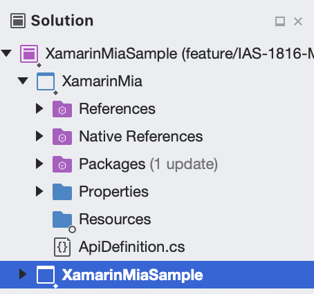

## This is a reference source code of an application (under MIT license) using the SDK, provided for demo purpose!

# Xamarin Integration Guide
This guided is intended to help you get up to speed and start implementing MiA - Easy iOS SDK right away.

**Note:** The `MiA Xamarin iOS` library is also available on [NuGet](https://www.nuget.org/).

## Step-by-step instruction
Include **MiA Xamarin SDK** in your application. You can do this in two ways:
Include NuGet solution `eu.nets.mia.mia-xamarin-ios` from **Nuget Gallery**. Just Add Package and it will be configured automatically. 
Manual installation: 

    1. From your solution, right click and choose **Add** and then **Add New Project**
    
    2. From the project Template, choose **Library** under **iOS** section and then choose **Binding Library**
    
    3. After adding new Binding Library to your solution, you will get the similar structure
    
    
    4. Navigate to your **Native References** folder, right click and choose **Add Native Reference**, from here choose the right place that contains MiA.framework
    5. Open your `ApiDefinition.cs`, replace the contents inside with this file contents. [ApiDefinition.cs](./Resources/ApiDefinition.cs) 
    
    6. Right click on your Binding Library solution and choose **Build [YOUR BINDING LIBRARY NAME]** to make sure everything is working as expected.

## Using new Binding Library with your project
1. From your project solution, right click on **Reference** folder and choose **Edit References...**
2. From the panel, navigate to **Projects** tab, check to include your new created Binding Library.
3. From any files that you want to use Binding Library, add the following line: `using [YOUR BINDING LIBRARY NAMESPACE];`

## Example usage
```c#
public void presentMiaSDK(string paymentID, String paymentURL)
{

    MiaCheckoutController miaSDK = MiaSDK.CheckoutControllerForPaymentWithID(paymentID, paymentURL, returnURL,
        (controller) => {
            // success
            controller.DismissViewController(true, null);
            showAlert("Please check payment status to confirm if payment is successful or cancelled", controller);
        },
        (controller) => {
            controller.DismissViewController(true, null);
            showAlert("Payment cancelled", controller);
        },
        (controller, error) => {
            controller.DismissViewController(true, null);
            showAlert("Error : {$error}", controller);
        });

    this.PresentViewController(miaSDK, true, null);
    
}
```

## Sample project
1. Open `XamarinMia.sln`.
2. Navigate to the XamarinMia section on project hierarchy.
3. Right click on **Native References**.
4. Choose **Add Native Reference**.
5. Choose `MiA.framework` (refer to the instruction how to get MiA.framework).
6. Build your project and start using.

